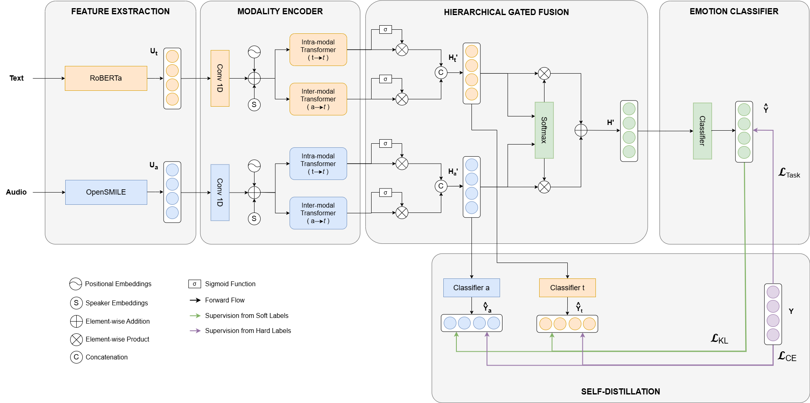

# Emotiotion Recognition in Conversation

<p align = "center">
  
</p>

<p align="center">
  <b>Group EmotionalByte</b>  
  <br>
  Final project for the course of Human Language Technologies (HLT)
  <br>
  Master’s Degree in Computer Science - Artificial Intelligence
  <br>
  at University of Pisa
</p>

## 👥 Authors
- Riccardo Berni        : [riccardoberni](https://github.com/riccardoberni)
- Michela Faella        : [MichelaFaella](https://github.com/MichelaFaella)
- Jessica Ferrari       : [JessFerrari](https://github.com/JessFerrari)
- Alessandro Guerriero  : [aleGuerriero](https://github.com/aleGuerriero)
- Margherita Merialdo   : [margheritamerialdo](https://github.com/margheritamerialdo)

---
  
## 📌 Overview

This project reimplements and extends the **Self-Distillation Transformer (SDT)** for **Emotion Recognition in Conversations (ERC)** using **textual** and **acoustic** modalities. Key techniques include:

- Self-distillation without external teacher models  
- Hierarchical gated fusion of modalities  
- Speaker personality embeddings derived from LLMs  
- Modular PyTorch pipeline based on the IEMOCAP dataset  
<p align = "center">
  
</p>
---

## 🔧 Features

-  Multimodal input: text + audio  
-  Custom loss functions for self-distillation (CE + KL)  
-  Fine-tuned RoBERTa (EmoBERTa) for text  
-  OpenSMILE-based audio embeddings  
-  Optional integration of personality embeddings  
-  Full experimental suite (ablation, baseline comparison, hyperparameter tuning)

---

## 🗃 Dataset

**IEMOCAP** [(Busso et al., 2008)](https://www.kaggle.com/datasets/dejolilandry/iemocapfullrelease) 
- Dyadic conversations (text, audio, video)  
- We use **text + audio** only  
- Reduced emotion set: {Happy, Sad, Angry, Neutral, Other}  
- Session-based split:  
  - Sessions 1–4 → training/validation  
  - Session 5 → test (speaker-independent)

---

## ⚙️ Installation

```bash
# Clone repository
git clone https://github.com/MichelaFaella/EmotionalByte.git
cd EmotionalByte

# Setup virtual environment
python -m venv venv
source venv/bin/activate

# Install requirements
pip install -r requirements.txt
